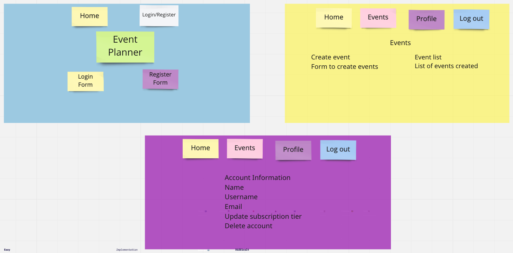

# Project 2
Authors: Will, Yang Su, HABIT

---
## Description
Our project's inspiration comes from club websites with three paid membership types, each with their own perks.
1. Standard Membership
    - Entitled to a free dessert
    - Entitled to a free cocktail
2. Senior Membership
    - Entitled to a free dessert
    - Entitled to a free cocktail
    - Entitled to free parking at any event
3. Luxury Membership
    - Entitled to a free dessert
    - Entitled to a free cocktail
    - Entitled to free parking at any event
    - Entitled to 3 free event tickets
    - Entitled to a custom-made cake at events

---
## User stories
1. When I register, I'm prompted to give the website my name, email address, and password, along with a selector for a different membership options.
2. When I login with my name or email and password, I'm directed to an events page.
7. When I login to my account I'm shown my name in a nav bar.
3. When I submit a form from the events page, it's posted to the list of events.
4. I can edit the event via a button from the events page, taking me to a page that's specific to the event.
5. I can delete events via another button which refreshes the events page.
6. In the nav bar, I can click a link that'll bring me to a description/account status page that describes the different membership tiers and displays my own.
7. I can change my membership tier in the aforementioned page.
8. I can click a button to mark an event as finished.

---
## Basic Website Layout

---
## Routes
| Header | Path | Description |
| :---: | :--- | :--- |
| POST | /members | New account signup |
| POST | /members/login | Account signin |
| GET | /members/account_info | Retrieve account status |
| GET | /members/events | Retrieve all account's events |
| PUT | /members | Update subscription level |
| DELETE | /members | Delete account |
| POST | /events | Create event |
| DELETE | /events | Delete event |

---
## MVP Achievement
- Use this DB structure for holding users, member classes and member ID's (one-to-one relationship)

- Allow for sign-up
- Choose membership status on the sign-up page
- Allow for login
- Allow for logout
- Allow for event creation
- Allow for event marking as complete
- Allow for event deletion
- Allow for changing membership status
- Have links to pages disappear based on login status
- Encrypt user data
- Hash user passwords

---
## Above and Beyond
- Use EJS to design the front end
  - We're planning on having a standard HTML, CSS, and JS frontend, but if we finish early, we'd like to try and use EJS, go over the VODs, and do some research on how EJS fully works
- Integrating another API with ours
  - BIG stretch - might be super hard to find the right API, since our project is so specific
- Adding social networking
  - Pretty easy stretch - just add a new database with tags to add to events
